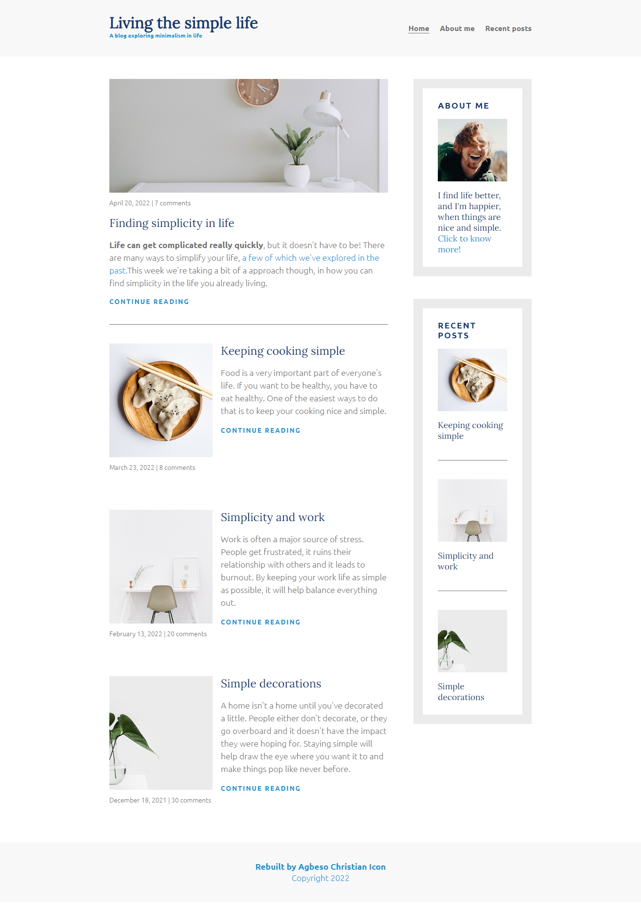

# A Responsive Multiple Page Blog-site built with HTML and CSS

Live Demo Here:  https://agbesochristian.github.io/Blog-site/

## Key Learnings
Semantic html
Image trimming
anchor elements
Using Flex box for page layout and structure
Responsiveness - Mobile first approach
Media queries

## Credit
A Scrimba project on responsive design - I decided to rebuild it to flex my CSS skills.
